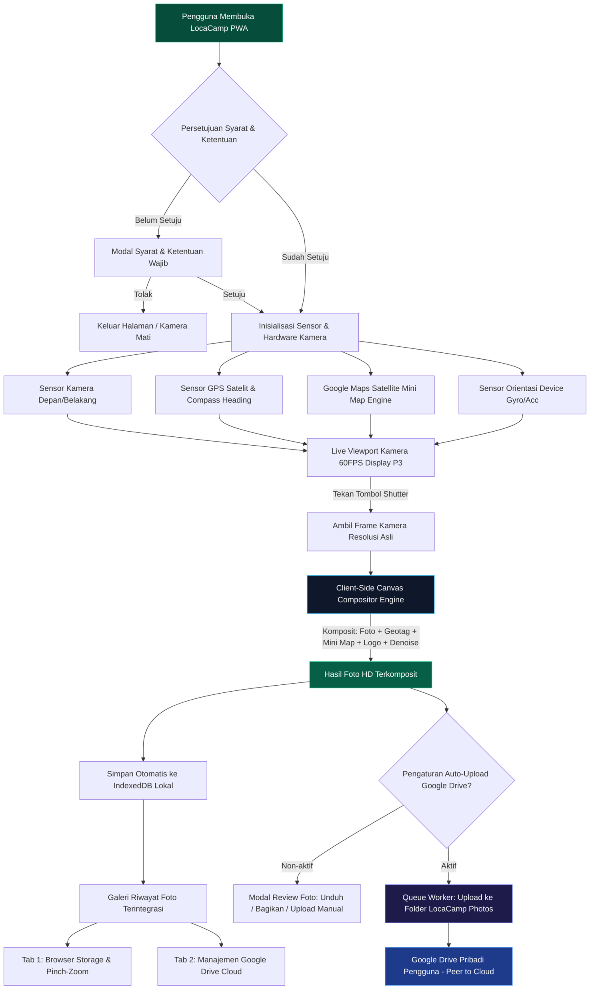

<div align="center">

  

  # 📸 LocaCamp
  ### Next-Generation Smart Geotagging Camera, Canvas Compositor & Google Drive Sync PWA
  
  **Platform Kamera Web Cerdas untuk Survei Lapangan, Inspeksi Teknis, Pemetaan Satelit GPS Real-Time, dan Pencadangan Awan Mandiri.**

  <p align="center">
    <a href="https://locacamp.pages.dev/" target="_blank"></a>
    <a href="https://github.com/maskodingku/LocaCamp"></a>
    <a href="https://react.dev/"></a>
    <a href="https://www.typescriptlang.org/"></a>
    <a href="https://vitejs.dev/"></a>
    <a href="https://tailwindcss.com/"></a>
    
    
    
    <a href="LICENSE"></a>
  </p>

  <p align="center">
    <a href="https://locacamp.pages.dev/" target="_blank">
      
    </a>
    <a href="https://locacamp.pages.dev/home" target="_blank">
      
    </a>
  </p>

  <p align="center">
    <a href="#-akses-live-demo--tautan-resmi">Tautan Resmi</a> •
    <a href="#-sekilas-tentang-locacamp">Tentang</a> •
    <a href="#-fitur-fitur-utama--kapabilitas-teknis">Fitur Utama</a> •
    <a href="#-arsitektur-dan-alur-kerja">Arsitektur</a> •
    <a href="#-tech-stack">Tech Stack</a> •
    <a href="#-struktur-direktori">Struktur Folder</a> •
    <a href="#-panduan-instalasi--menjalankan">Instalasi</a> •
    <a href="#-profil-pengembang--dedikasi-resmi">Profil Pengembang</a> •
    <a href="#-kepatuhan-kebijakan-data-pengguna-google">Kepatuhan Google</a>
  </p>
</div>

---

## 🌐 Akses Live Demo & Tautan Resmi

Aplikasi **LocaCamp** telah di-deploy dan berjalan aktif secara global melalui jaringan edge CDN Cloudflare Pages. Anda dapat langsung menguji seluruh fitur kamera, geotagging satelit, filter visual, dan sinkronisasi Google Drive tanpa instalasi aplikasi pihak ketiga:

| Layanan | URL Publik | Deskripsi |
| :--- | :--- | :--- |
| 📸 **Aplikasi Kamera Utama (PWA)** | [**https://locacamp.pages.dev/**](https://locacamp.pages.dev/) | Kamera geotagging real-time, komposit watermark, dan riwayat offline. |
| 🏠 **Beranda Resmi (Official Homepage)** | [**https://locacamp.pages.dev/home**](https://locacamp.pages.dev/home) | Halaman beranda resmi kepemilikan pengembang sesuai panduan Google Cloud (answer/13807376). |
| 🛡️ **Kebijakan Privasi (Privacy Policy)** | [**https://locacamp.pages.dev/privacy**](https://locacamp.pages.dev/privacy) | Klausul kepatuhan Google User Data Policy (Limited Use), jaminan 100% on-device, tanpa pelacak. |
| 📄 **Ketentuan Layanan (Terms of Service)** | [**https://locacamp.pages.dev/terms**](https://locacamp.pages.dev/terms) | Syarat & ketentuan lisensi MIT, integritas data survei, dan batasan tanggung jawab. |
| 💻 **Repositori Kode Sumber Terbuka** | [**https://github.com/maskodingku/LocaCamp**](https://github.com/maskodingku/LocaCamp) | Kode sumber lengkap, terbuka, dan transparan untuk audit keamanan. |

---

## 🌟 Sekilas Tentang LocaCamp

**LocaCamp** adalah platform kamera web modern (*Progressive Web Application*) yang dirancang khusus untuk memvalidasi dan mengotomatisasi dokumentasi lapangan secara instan. Menggabungkan sensor optik kamera, sensor GPS satelit presisi tinggi, *reverse geocoding* alamat jalan, *hardware orientation sensing*, rendering kanvas Display P3 bergamut warna lebar, dan sinkronisasi peer-to-cloud ke Google Drive, **LocaCamp** menghasilkan foto dokumentasi berstandar industri dengan stempel lokasi presisi dan logo resmi instansi tanpa memerlukan instalasi aplikasi manual (APK/App Store).

Semua pemrosesan citra komposit dan penyimpanan riwayat berlangsung **100% di sisi perangkat pengguna (client-side)** tanpa server perantara pengumpul data, menjamin privasi absolut, nol latensi upload, dan kebebasan penggunaan saat berada di lapangan terpencil.

---

## ✨ Fitur-Fitur Utama & Kapabilitas Teknis

### 1. 🛰️ Geotagging Satelit Presisi & Mini Map Satelit
- **Koordinat Satelit Real-time**: Menampilkan Lintang (*Latitude*), Bujur (*Longitude*), Elevasi (*Altitude*), dan Tingkat Akurasi GPS (dalam radius meter).
- **Arah Kompas Presisi (Heading/Azimuth)**: Menampilkan orientasi arah mata angin kamera derajat secara langsung.
- **Penyematan Mini Map Satelit Terintegrasi**: Menyematkan cuplikan visual peta satelit Google Maps langsung pada stempel kanvas foto survei dengan sistem failover subdomain otomatis.
- **Reverse Geocoding Terbalik**: Menerjemahkan titik koordinat mentah menjadi nama jalan, kelurahan, kecamatan, kota, hingga provinsi secara otomatis.
- **Zona Waktu Cerdas**: Mendeteksi otomatis zona waktu setempat (**WIB**, **WITA**, **WIT**, atau GMT) berdasarkan bujur posisi pemotretan.
- **Penempatan 9 Titik Kuadran**: Fleksibilitas menentukan posisi stempel geotag di 9 area layar (Kiri Atas, Tengah Atas, Kanan Atas, Kiri Tengah, Tengah Layar, Kanan Tengah, Kiri Bawah, Tengah Bawah, Kanan Bawah).

### 2. ☁️ Pencadangan Awan Google Drive Mandiri (OAuth 2.0 Client-Side)
- **Koneksi 1-Klik Instan**: Terintegrasi langsung dengan Google OAuth 2.0 Client resmi tanpa mengharuskan pengguna mengisi formulir Client ID yang rumit.
- **Scope Akses Minimal (`drive.file`)**: Aplikasi hanya meminta izin `https://www.googleapis.com/auth/drive.file` yang dibatasi khusus untuk file yang dibuat oleh LocaCamp.
- **Isolasi Folder Otomatis**: Seluruh foto survei otomatis disimpan ke folder khusus bernama **LocaCamp Photos** di Google Drive pribadi pengguna tanpa mengakses folder/dokumen lain.
- **Sistem Antrian Unggah (Queue Worker)**: Dilengkapi worker antrian latar belakang dengan kontrol kapasitas pengunggahan serentak (*bulk queue concurrency*).
- **Auto-Upload Setelah Jepret**: Opsi otomatis memasukkan foto yang baru saja dijepret ke dalam antrian unggah Google Drive.
- **Indikator & Notifikasi Status**:
  - Tombol aksi cepat *"Unggah X Foto Tertunda"* jika ada foto lokal yang belum dicadangkan ke Google Drive.
  - Tanda badge ikon Google Drive hijau pada kartu foto yang telah berhasil diunggah.
  - Animasi progress bar dan penghitung persentase unggahan real-time.
- **Galeri Riwayat Dua Tab**: Tab 1 *Penyimpanan Browser (IndexedDB)* dan Tab 2 *Google Drive* untuk peninjauan foto awan.

### 3. 📷 Hardware Camera Engine, Display P3 & Sensor Kualitas Tinggi
- **Pilihan Resolusi Sensor Kamera**: Mendukung pemilihan resolusi sensor dari *Auto Max Sensor*, *12 MP*, *24 MP*, *48 MP*, *50 MP*, hingga *108 MP* ultra-tajam.
- **JPEG Quality Tiers**: 4 tingkatan kompresi visual: Standar (85%), Tajam (95%), Ultra HD (98%), dan Lossless P3 (100%).
- **Wide Gamut Color & Display P3 Engine**: Render kanvas memanfaatkan ruang warna lebar Display P3 untuk mempertahankan kekayaan warna asli sensor kamera tanpa degradasi saturasi.
- **Algoritma Denoise & Penjernih Foto**: Algoritma penghalus derau otomatis untuk menjaga kejernihan foto saat pemotretan dalam kondisi cahaya rendah (*low-light*).
- **Live Visual Presets & Finetuning**:
  - 6 preset warna real-time: *Standard*, *Vivid*, *Warm*, *Cold*, *Monochrome*, dan *Golden Hour*.
  - Slider penyesuaian langsung: Kecerahan (*Brightness*), Kontras (*Contrast*), dan Kejenuhan (*Saturation*).
- **Mode Cermin Kamera (Mirror Mode)**: Saklar mode cermin untuk kamera depan dan kamera belakang dengan sinkronisasi framing *What You See Is What You Get (WYSIWYG)*.
- **Kontrol Senter (Torch) & Multi-Lensa**: Mengaktifkan lampu senter perangkat dan beralih kamera depan/belakang secara instan.

### 4. 🎨 Kustomisasi Watermark Logo & Transparansi Live
- **Logo Resmi Bawaan**: Logo resmi perusahaan (**PT Wahana Mitra Amerta**) dan konsep resmi LocaCamp telah tertanam bawaan.
- **Unggah Logo Kustom**: Pengguna dapat mengunggah logo perusahaan atau proyek sendiri dengan auto-resize & kompresi di peramban.
- **Mode Transparan Live Pratinjau**: Saat pengguna menggeser slider pengaturan watermark, tampilan kamera tetap aktif dan transparan (*transparent live preview*) sehingga perubahan dapat dilihat langsung tanpa menutup menu.
- **Penempatan Sudut & Opasitas**: Atur posisi logo di 4 sudut layar dengan slider transparansi dari 0% hingga 100%.

### 5. 🗄️ Riwayat Foto Offline Cerdas (IndexedDB Storage)
- **Penyimpanan Lokal Mandiri**: Seluruh hasil jepretan disimpan di database `IndexedDB` perangkat pengguna, tidak membebani kuota `localStorage` dan tidak membutuhkan internet.
- **Gestur Sentuh Dua Jari (Pinch-to-Zoom & Pan)**: Perbesar foto inspeksi hingga 4x zoom dan geser posisi untuk memeriksa detail lapangan terkecil.
- **Gestur Usap (Swipe Gestures)**: Navigasi geser jari ke kiri atau kanan untuk berpindah antar foto dalam mode layar penuh.
- **Pure Fullscreen Mode**: Mode layar penuh murni tanpa elemen navigasi dengan ketukan layar (*tap to toggle toolbar*).
- **Pencarian Cerdas & Filter Waktu**: Pencarian cepat berbasis nama jalan, koordinat, atau tanggal serta filter rentang (*Hari Ini*, *7 Hari*, *Bulan Ini*).

### 6. 🔋 Manajemen Hardware & Smart Multi-Tab Broadcaster
- **Deteksi Multi-Tab Otomatis (`BroadcastChannel`)**: Jika pengguna membuka LocaCamp di tab peramban baru, tab sebelumnya secara otomatis mematikan kamera untuk mencegah konflik akses hardware dan menjaga performa perangkat.
- **Hemat Daya Hardware (Power Saving)**: Sensor kamera optik otomatis **dimatikan total** saat pengguna membuka menu Pengaturan (*Settings Drawer*), galeri riwayat foto, modal review foto, dialog syarat ketentuan, maupun halaman beranda statis.

### 7. 📱 Navigasi Mobile Native & Progressive Web App (PWA)
- **Dukungan Tombol Back Fisik Ponsel**: Integrasi `window.history` dan event `popstate` berjenjang (*Fullscreen Inspect → Riwayat Foto → Kamera Utama*).
- **Tata Letak Adaptif Landscape**: Saat ponsel diputar mendatar, kontrol shutter otomatis berpindah ke sisi kanan layar untuk kenyamanan genggaman jempol.
- **Instalasi PWA 1-Klik**: Dapat dipasang ke layar utama ponsel (Android & iOS) dan desktop (Windows, Mac, Linux) tanpa melalui toko aplikasi.
- **Offline Capable**: *Service Worker* dan aset statis siap beroperasi sepenuhnya meski tanpa koneksi internet.

### 8. ⚖️ Kepatuhan Legal & Transparansi Google Cloud Platform
- **Halaman Beranda Resmi (`/home`)**: Mengikuti panduan resmi Google Cloud [App Homepage (answer/13807376)](https://support.google.com/cloud/answer/13807376) dengan verifikasi identitas resmi pengembang **Abdi Syahputra Harahap** dan email dukungan **Anggista Parasela**.
- **Klausul Limited Use Google API**: Menegaskan kepatuhan penuh terhadap *Google API Services User Data Policy*.
- **Modal Persetujuan Syarat & Ketentuan**: Konfirmasi izin legal saat pertama kali pengguna membuka aplikasi dengan penyimpanan status lokal aman.
- **Verifikasi Domain GSC**: Integrasi file verifikasi HTML dan meta tag Google Site Verification.

---

## 🏗️ Arsitektur dan Alur Kerja



---

## 💻 Tech Stack

| Kategori | Teknologi | Deskripsi |
| :--- | :--- | :--- |
| **Frontend Framework** | **React 19** + **TypeScript** | Arsitektur komponen modular (*Anti-Monolith*) dengan keamanan tipe ketat. |
| **Build Tool & Bundler** | **Vite 8** | Bundler ultra cepat dengan *Hot Module Replacement* dan optimasi gzip. |
| **Styling & Desain** | **Tailwind CSS v4** | Desain antarmuka *Dark Mode* modern berestetika tinggi dan responsif ponsel. |
| **Icon Library** | **Lucide React** | Ikon vektor presisi dan konsisten di seluruh antarmuka. |
| **Mesin Grafis & Render** | **HTML5 Canvas 2D API (Display P3)** | Pemrosesan citra resolusi tinggi, minimap, dan komposit watermark di browser. |
| **Penyimpanan Lokal** | **IndexedDB & LocalStorage** | Database terstruktur lokal untuk riwayat foto survei dan konfigurasi. |
| **Integrasi Cloud** | **Google Drive REST API v3 (OAuth 2.0)** | Unggah peer-to-cloud langsung ke folder terisolasi pengguna tanpa server perantara. |
| **PWA & Offline** | **Web App Manifest + Service Worker** | Aplikasi mandiri yang dapat dipasang di Android, iOS, Windows, dan MacOS. |
| **Local Web Server** | **Node.js ESM (`app.js`)** | Server lokal Express statis ringan dengan proteksi directory traversal & routing SPA. |
| **Cloud Deployment** | **Cloudflare Pages** | Hosting edge global dengan auto-deploy terhubung ke cabang `main` GitHub. |

---

## 📁 Struktur Direktori

```text
LocaCamp/
├── UI/                                 # Sumber kode antarmuka aplikasi (React 19 + TypeScript + Vite 8)
│   ├── public/                         # Aset publik statis (favicon, logo, manifest, service worker, verifikasi GSC)
│   ├── src/
│   │   ├── assets/                     # Grafis aplikasi, logo resmi, dan foto profil pengembang
│   │   ├── components/
│   │   │   ├── camera/                 # Viewport kamera, tombol shutter, dan kontrol flash
│   │   │   ├── history/                # Modal riwayat foto, antrian Drive, tab local/cloud, zoom
│   │   │   ├── home/                   # Komponen modular halaman beranda resmi (/home)
│   │   │   ├── legal/                  # Komponen kebijakan privasi (/privacy) & syarat layanan (/terms)
│   │   │   ├── overlay/                # Geotag badge, watermark layer, minimap, status satelit
│   │   │   ├── preview/                # Modal review foto jepretan, unduh, dan bagikan
│   │   │   └── settings/               # Drawer pengaturan kamera, watermark, denoise, Google Drive
│   │   ├── hooks/
│   │   │   ├── useCamera.ts            # Hook kontrol stream kamera, resolusi, cermin, dan senter
│   │   │   ├── useGeolocation.ts       # Hook sensor GPS satelit, akurasi, dan reverse geocoding
│   │   │   ├── useGoogleDrive.ts       # Hook integrasi Google Drive OAuth 2.0 & status sesi
│   │   │   ├── useGoogleDriveQueue.ts  # Hook queue worker antrian unggah latar belakang
│   │   │   ├── useModalHistory.ts      # Hook navigasi tombol back ponsel (popstate)
│   │   │   ├── useOrientation.ts       # Hook sensor orientasi fisik (portrait/landscape)
│   │   │   └── usePWAInstall.ts        # Hook prompt instalasi aplikasi PWA
│   │   ├── services/
│   │   │   └── googleDriveService.ts   # Handler API Google Drive multipart upload
│   │   ├── types/                      # Definisi tipe data & interface TypeScript
│   │   ├── utils/
│   │   │   ├── canvasComposite.ts      # Mesin komposit foto, watermark, geotag, denoise
│   │   │   ├── miniMapGenerator.ts     # Generator cuplikan peta satelit Google Maps
│   │   │   ├── photoStorage.ts         # Engine database IndexedDB lokal
│   │   │   ├── storage.ts              # Handler konfigurasi lokal (localStorage)
│   │   │   └── timezone.ts             # Algoritma zona waktu otomatis WIB/WITA/WIT
│   │   ├── App.tsx                     # Router SPA & orchestrator komponen utama
│   │   ├── index.css                   # Tailwind CSS styling & custom utility
│   │   └── main.tsx                    # Entry point React 19
│   ├── package.json                    # Dependensi frontend UI
│   └── vite.config.ts                  # Konfigurasi bundler Vite 8
├── siap-deploy/                        # Folder hasil build produksi siap saji (Vite output)
├── app.js                              # Server lokal Node.js ESM untuk melayani aplikasi
├── package.json                        # Root runner script proyek
├── LICENSE                             # Lisensi resmi MIT Hak Cipta
└── README.md                           # Dokumentasi resmi proyek LocaCamp
```

---

## 🚀 Panduan Instalasi & Menjalankan

### Prasyarat Sistem
- **Node.js**: Versi `18.x`, `20.x`, atau lebih baru
- **Peramban Web**: Google Chrome, Microsoft Edge, Safari, atau Firefox versi modern dengan izin akses Kamera dan Lokasi (HTTPS / Localhost).

### Langkah 1: Kloning Repositori
```bash
git clone https://github.com/maskodingku/LocaCamp.git
cd LocaCamp
```

### Langkah 2: Instalasi Dependensi
```bash
# Instal dependensi root
npm install

# Instal dependensi frontend UI
cd UI
npm install
cd ..
```

### Langkah 3: Menjalankan Mode Pengembangan (Vite Dev Server)
Untuk melakukan perubahan kode dengan *Hot Module Replacement (HMR)*:
```bash
cd UI
npm run dev
```
Akses aplikasi melalui alamat lokal yang ditampilkan (biasanya `http://localhost:5173`).

### Langkah 4: Kompilasi Hasil Produksi
Untuk mengompilasi kode ke mode produksi:
```bash
npm run build --prefix UI
```

### Langkah 5: Menjalankan Server Produksi Lokal
Jalankan server lokal Node.js ESM untuk melayani aplikasi:
```bash
npm start
```
Buka peramban dan akses: **`http://localhost:3000`**.

---

## 🔒 Kepatuhan Kebijakan Data Pengguna Google (Google User Data Policy)

Aplikasi **LocaCamp** mematuhi sepenuhnya kebijakan privasi pengguna Google API:
1. **Scope Akses Minimal**: Aplikasi hanya menggunakan izin `https://www.googleapis.com/auth/drive.file`. Izin ini secara khusus hanya memberikan hak akses kepada file dan folder yang dibuat langsung oleh LocaCamp.
2. **Koneksi Peer-to-Cloud Langsung**: Pengunggahan foto survei dilakukan langsung dari peramban perangkat pengguna ke server Google Drive via protokol HTTPS aman, tanpa pernah melalui server proxy atau perantara pihak ketiga.
3. **Pernyataan Penggunaan Terbatas (Limited Use Disclosure)**:
   > *"Penggunaan dan transfer informasi yang diterima dari Google API oleh LocaCamp ke aplikasi lain mana pun akan mematuhi Kebijakan Data Pengguna Layanan Google API (Google API Services User Data Policy), termasuk persyaratan Penggunaan Terbatas (Limited Use requirements)."*
4. **Pencabutan Izin Kapan Saja**: Pengguna dapat memutuskan integrasi Google Drive secara instan melalui menu Pengaturan atau langsung melalui dashboard akun Google di `https://myaccount.google.com/permissions`.

---

## 👨‍💻 Profil Pengembang & Kepemilikan Resmi

<div align="center">
  

  ### **Abdi Syahputra Harahap**
  **Lead Fullstack Developer & Creator of LocaCamp PWA**  
  *Spesialisasi: High-Performance Distributed Systems, Canvas 2D Graphic Engine, and Modern Web Architectures.*

  📧 Kontak Pengembang: [maskoding12@gmail.com](mailto:maskoding12@gmail.com)  
  🌐 Repositori GitHub: [https://github.com/maskodingku/LocaCamp](https://github.com/maskodingku/LocaCamp)

  <br/>

  ### **Anggista Parasela**
  **Project Co-Owner & Official Support Lead**  
  *Pemilik Akun Google Cloud Platform & Properti Terverifikasi Google Search Console (GSC).*

  📧 Email Dukungan Resmi: [anggistaparasela@gmail.com](mailto:anggistaparasela@gmail.com)
</div>

<br/>

> ### 🏛️ Pernyataan Resmi Dedikasi Perusahaan
> 
> *"Aplikasi ini saya kembangkan dan dedikasikan secara khusus sebagai bentuk rasa terima kasih yang mendalam serta loyalitas penuh kepada jajaran Manajemen dan Keluarga Besar **PT Wahana Mitra Amerta** atas amanah dan kepercayaan yang telah diberikan dalam mengangkat saya sebagai bagian dari perusahaan.*
> 
> *Semoga inovasi sistem dokumentasi geotagging ini memberikan kontribusi nyata dalam memperkuat akurasi data lapangan, efisiensi operasional pengawasan, dan keunggulan teknologi digital **PT Wahana Mitra Amerta** ke depan."*
> 
> **— Abdi Syahputra Harahap**

---

## 📄 Lisensi

Proyek ini dilindungi di bawah lisensi resmi **[MIT License](LICENSE)**.  
Hak Cipta © 2026 **Abdi Syahputra Harahap**, **Anggista Parasela**, & **PT Wahana Mitra Amerta**.  

*Penggunaan, modifikasi, dan distribusi kode diperbolehkan dengan syarat mencantumkan pemberitahuan hak cipta resmi dan teks lisensi asli ini dalam seluruh salinan perangkat lunak.*
