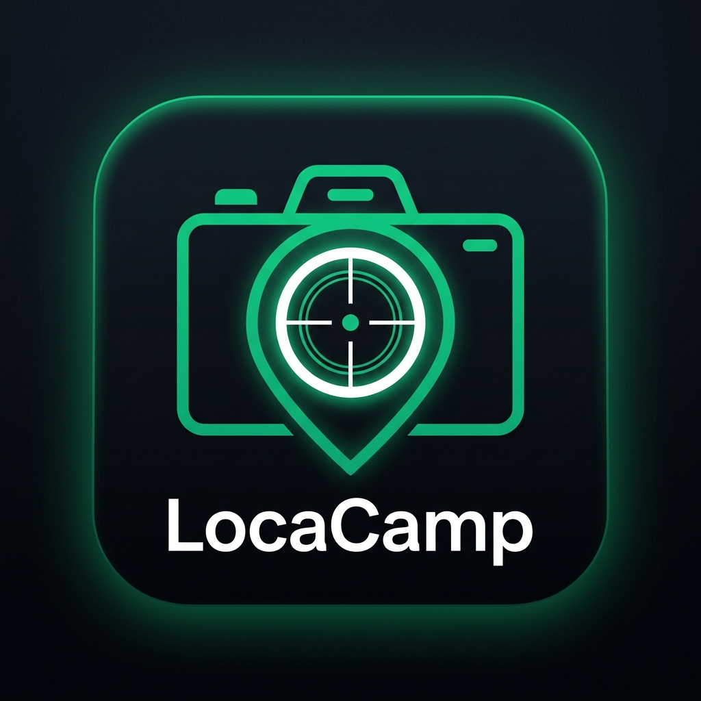
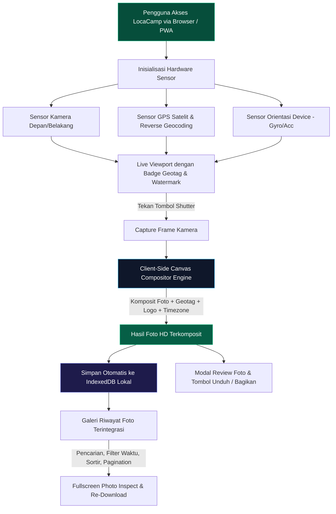

<div align="center">

  

  # 📸 LocaCamp
  ### Next-Generation Geotagging Camera & Real-Time Watermarking PWA
  
  **Solusi Dokumentasi Lapangan Presisi Satelit, 100% Pemrosesan Klien, Tanpa Instalasi Aplikasi.**

  <p align="center">
    <a href="https://locacamp.pages.dev/" target="_blank"></a>
    <a href="https://github.com/maskodingku/LocaCamp"></a>
    <a href="https://react.dev/"></a>
    <a href="https://www.typescriptlang.org/"></a>
    <a href="https://vitejs.dev/"></a>
    <a href="https://tailwindcss.com/"></a>
    
    
    <a href="LICENSE"></a>
  </p>

  <p align="center">
    <a href="https://locacamp.pages.dev/" target="_blank">
      
    </a>
  </p>

  <p align="center">
    <a href="#-akses-live-demo-produksi">Live Demo</a> •
    <a href="#-sekilas-tentang-locacamp">Tentang</a> •
    <a href="#-keunggulan--fitur-utama">Fitur Utama</a> •
    <a href="#-arsitektur-dan-alur-kerja">Arsitektur</a> •
    <a href="#-tech-stack">Tech Stack</a> •
    <a href="#-struktur-direktori">Struktur Folder</a> •
    <a href="#-panduan-instalasi--menjalankan">Instalasi</a> •
    <a href="#-profil-pengembang--dedikasi-resmi">Pengembang</a>
  </p>
</div>

---

## 🌐 Akses Live Demo Produksi

Aplikasi **LocaCamp** telah dipublikasikan dan aktif secara global di jaringan edge Cloudflare Pages. Anda dapat langsung menguji coba seluruh kapabilitas fitur secara langsung melalui peramban ponsel pintar maupun komputer tanpa instalasi aplikasi tambahan:

🔗 **Tautan Live Demo**: [**https://locacamp.pages.dev**](https://locacamp.pages.dev/)

> [!TIP]
> **Panduan Pengujian Optimal**:
> 1. Buka tautan di atas melalui peramban mobile (seperti **Google Chrome** di Android atau **Safari** di iOS).
> 2. Izinkan permintaan **Akses Kamera** dan **Akses Lokasi (GPS)** agar sistem satelit dapat mendeteksi koordinat dan menerjemahkan alamat jalan secara real-time.
> 3. Anda juga dapat menekan tombol **Install App** yang muncul di bagian atas kamera untuk memasang LocaCamp langsung ke layar utama (*homescreen*) sebagai **Progressive Web App (PWA)** mandiri.

---

## 🌟 Sekilas Tentang LocaCamp

**LocaCamp** adalah platform kamera web modern (*Progressive Web Application*) yang dirancang khusus untuk memvalidasi dan mengotomatisasi dokumentasi lapangan secara real-time. Dengan menggabungkan teknologi kamera peramban, sensor GPS berakurasi tinggi, *reverse geocoding*, *hardware orientation sensing*, dan *client-side canvas rendering engine*, **LocaCamp** menghasilkan foto dokumentasi berstandar industri lengkap dengan stempel lokasi presisi dan logo resmi tanpa memerlukan instalasi aplikasi tambahan (APK/App Store).

Semua proses pengolahan gambar dan penyimpanan riwayat foto berlangsung **100% di sisi perangkat pengguna (client-side)** tanpa mengirim foto mentah ke server eksternal, menjamin privasi maksimal, nol latensi upload, dan efisiensi kuota data.

---

## ✨ Keunggulan & Fitur Utama

### 1. 🛰️ Geotagging Live Presisi Tinggi & Reverse Geocoding
- **Koordinat Satelit Real-time**: Menampilkan garis lintang (*latitude*) dan garis bujur (*longitude*) dengan akurasi 5 desimal.
- **Indikator Akurasi GPS**: Menghitung dan menampilkan toleransi radius akurasi satelit dalam satuan meter secara dinamis.
- **Reverse Geocoding Terintegrasi**: Mengonversi titik koordinat mentah menjadi nama jalan, kelurahan, kecamatan, kota, hingga provinsi secara otomatis.
- **Zona Waktu Otomatis**: Mendeteksi secara cerdas zona waktu setempat (**WIB**, **WITA**, **WIT**, atau GMT) berdasarkan bujur posisi pemotretan.
- **Tombol Kalibrasi Ulang (Refresh GPS)**: Pengguna dapat menyegarkan koordinat GPS secara manual langsung dari antarmuka kamera jika posisi berpindah.

### 2. 📸 Hardware Camera Controls & Ergonomic Shutter
- **Dukungan Multi-Lensa**: Beralih instan antara kamera belakang (*environment/wide*) dan kamera depan (*selfie*) dengan koreksi *auto-mirror*.
- **Kontrol Senter (Torch/Flashlight)**: Mengaktifkan lampu senter perangkat langsung dari peramban untuk pengambilan foto di area gelap atau malam hari.
- **Deteksi Orientasi Fisik Cerdas (Gyro & Accelerometer)**:
  - **Tata Letak Adaptif Landscape**: Saat ponsel diputar ke orientasi mendatar, tombol shutter dan kontrol aksi otomatis berpindah ke sisi kanan layar, memberikan pengalaman ergonomis untuk jempol layaknya kamera digital profesional.
  - **Stabilisasi Watermark Anti-Guncang**: Watermark dan badge lokasi terkunci kokoh pada orientasi sudut baku (0°, 90°, 180°, 270°) dan tidak berputar liar saat perangkat mengalami kemiringan kecil.

### 3. 🎨 Kustomisasi Watermark Logo & Teks Fleksibel
- **Logo Resmi Bawaan**: Logo resmi perusahaan (**PT Wahana Mitra Amerta**) dan logo konsep LocaCamp telah tertanam secara bawaan.
- **Unggah Logo Kustom**: Pengguna dapat mengunggah logo perusahaan atau proyek sendiri dengan kompresi cerdas otomatis di browser.
- **Penempatan 4 Sudut**: Pilih posisi peletakan logo (Kiri Atas, Kanan Atas, Kiri Bawah, Kanan Bawah).
- **Pengaturan Proporsi & Transparansi**: Atur ukuran logo (Kecil, Sedang, Besar) dan tingkat opasitas (0% hingga 100%).
- **Pengaturan Ukuran Tulisan Lokasi**: Opsi ukuran tulisan geotag (Kecil, Sedang, Besar) dengan nilai *default* yang rapi dan tidak menutupi objek foto.
- **Penyimpanan Setelan Otomatis (Auto-Save)**: Semua preferensi disimpan di `localStorage` peramban dan tersedia opsi **Reset Default** untuk mengembalikan setelan ke awal pabrikan kapan saja.

### 4. ⚡ 100% Client-Side Canvas Compositor
- **Zero Server Overhead**: Penggabungan foto kamera, stempel geotag, badge alamat, dan watermark logo dieksekusi menggunakan **HTML5 Canvas 2D Engine** berkecepatan tinggi di browser pengguna.
- **Output Beresolusi Tinggi (FHD/4K)**: Gambar hasil jepretan mempertahankan ketajaman asli sensor kamera perangkat.
- **Unduh & Berbagi Cepat**: Dilengkapi fitur *one-click download* serta integrasi **Web Share API** untuk membagikan foto beserta koordinat langsung ke WhatsApp, Telegram, email, atau drive.

### 5. 🗄️ Riwayat Foto Offline Terintegrasi (IndexedDB Storage)
- **Penyimpanan Lokal Mandiri**: Setiap foto yang dijepret secara otomatis tersimpan di database lokal browser pengguna (**IndexedDB**), tidak membebani memori `localStorage` dan tidak memerlukan koneksi internet.
- **Pencarian Cerdas**: Pencarian instan berbasis teks nama jalan, kota, koordinat, maupun tanggal pemotretan.
- **Filter Waktu & Urutan**: Filter rentang waktu (*Semua*, *Hari Ini*, *7 Hari Terakhir*, *Bulan Ini*) serta tombol sortir (*Terbaru* / *Terlama*).
- **Pagination Elegan**: Pembagian halaman rapi (6 foto per halaman) dengan penghitung total item.
- **Fullscreen Photo Inspect**: Pratinjau foto utuh dengan kemampuan unduh ulang resolusi asli kapan saja.
- **Manajemen Aman**: Hapus foto individual atau bersihkan seluruh galeri dengan dialog konfirmasi aman.

### 6. 📱 Navigasi Ponsel Alami (Native Mobile Back Button Support)
- **Modal History Stack Terintegrasi**: Mengintegrasikan `window.history` dan event `popstate` peramban.
- **Navigasi Bertingkat (Hierarchical Back)**: Menekan tombol *Back* fisik ponsel atau gestur usap tepi layar pada Android/iOS akan menutup layer teratas secara berjenjang (*Pratinjau Penuh → Galeri Riwayat → Kamera Utama*), mencegah aplikasi tertutup mendadak secara tidak sengaja.
- **Sinkronisasi Dua Arah**: Tombol di layar ('X', 'Kembali', 'Batal') dan tombol fisik ponsel tersinkronisasi sempurna tanpa konflik riwayat.

### 7. 🚀 Progressive Web Application (PWA)
- **Instalasi Satu Klik**: Tombol pasang aplikasi langsung di layar kamera peramban untuk pengguna Android, Windows, Mac, dan iOS.
- **Mode Standalone**: Berjalan dalam jendela aplikasi mandiri tanpa *address bar* peramban, memberikan sensasi aplikasi *native*.
- **Offline Capable**: *Service Worker* dan aset statis siap pakai bahkan saat berada di pedalaman tanpa sinyal internet.

---

## 🏗️ Arsitektur dan Alur Kerja



---

## 💻 Tech Stack

| Kategori | Teknologi | Deskripsi |
| :--- | :--- | :--- |
| **Frontend Framework** | **React 19** + **TypeScript** | Arsitektur komponen modular dengan *strict type safety* tingkat tinggi. |
| **Build Tool & Bundler** | **Vite 6** | *Lightning-fast HMR* dan hasil build teroptimasi dengan kompresi gzip. |
| **Styling & Theme** | **Tailwind CSS v4** | Desain antarmuka *Dark Mode* ultra-modern bergaya Linear / Vercel. |
| **Iconography** | **Lucide React** | Ikon vektor presisi dan konsisten. |
| **Grafis & Pengolahan** | **HTML5 Canvas 2D API** | Pemrosesan citra komposit resolusi tinggi secara *real-time* di sisi klien. |
| **Penyimpanan Klien** | **IndexedDB** & **LocalStorage** | Database terstruktur lokal untuk riwayat foto dan persistensi konfigurasi. |
| **Aplikasi Native (PWA)** | **Web App Manifest + Service Worker** | Standalone web app yang dapat diinstal langsung ke layar utama ponsel. |
| **Local Deployment** | **Node.js ESM (`app.js`)** | Server lokal berbasis Express ringan untuk menyajikan aplikasi produksi. |
| **Cloud Deployment** | **Cloudflare Pages** | Platform *edge hosting* global dengan auto-deploy terhubung ke branch main. |

---

## 📁 Struktur Direktori

```text
LocaCamp/
├── UI/                         # Source code antarmuka utama (React 19 + TypeScript + Vite)
│   ├── public/                 # Aset statis peramban (favicon, logo, manifest, service worker)
│   ├── src/
│   │   ├── assets/             # Aset grafis aplikasi, logo resmi, dan foto profil
│   │   ├── components/
│   │   │   ├── camera/         # Viewport kamera, tombol shutter, dan kontrol torch
│   │   │   ├── history/        # Modal riwayat foto, filter, pagination, dan inspect view
│   │   │   ├── overlay/        # Geotag badge, watermark layer, dan status satelit
│   │   │   ├── preview/        # Modal review foto jepretan dan unduh HD
│   │   │   └── settings/       # Drawer pengaturan, kustomisasi logo, dan menu about
│   │   ├── hooks/
│   │   │   ├── useCamera.ts         # Hook kontrol kamera dan resolusi stream
│   │   │   ├── useGeolocation.ts    # Hook GPS satelit dan reverse geocoding
│   │   │   ├── useModalHistory.ts   # Hook navigasi tombol back ponsel (popstate)
│   │   │   ├── useOrientation.ts    # Hook sensor orientasi fisik (portrait/landscape)
│   │   │   └── usePWAInstall.ts     # Hook prompt instalasi aplikasi PWA
│   │   ├── types/                   # Definisi interface dan tipe data TypeScript
│   │   ├── utils/
│   │   │   ├── canvasComposite.ts   # Mesin komposit foto, watermark, dan geotag
│   │   │   ├── photoStorage.ts      # Engine database IndexedDB sisi klien
│   │   │   ├── storage.ts           # Handler konfigurasi lokal (localStorage)
│   │   │   └── timezone.ts          # Algoritma deteksi zona waktu WIB/WITA/WIT
│   │   ├── App.tsx             # Komponen orkestrasi utama
│   │   ├── index.css           # Styling dasar dan utility class kustom
│   │   └── main.tsx            # Entry point React 19
│   ├── package.json            # Dependensi paket UI
│   └── vite.config.ts          # Konfigurasi bundler Vite
├── app.js                      # Server lokal Node.js ESM untuk melayani aplikasi
├── package.json                # Script runner root proyek
├── LICENSE                     # Lisensi resmi MIT Hak Cipta
└── README.md                   # Dokumentasi resmi proyek LocaCamp
```

---

## 🚀 Panduan Instalasi & Menjalankan

### Prasyarat Sistem
- **Node.js**: Versi `18.x` atau lebih baru
- **Peramban Web**: Google Chrome, Microsoft Edge, Safari, atau Firefox versi modern dengan izin akses Kamera dan Lokasi (HTTPS / Localhost).

### Langkah 1: Kloning Repositori
```bash
git clone https://github.com/maskodingku/LocaCamp.git
cd LocaCamp
```

### Langkah 2: Instalasi Dependensi
```bash
# Instal dependensi root
npm install

# Instal dependensi frontend UI
cd UI
npm install
cd ..
```

### Langkah 3: Menjalankan Mode Pengembangan (Vite Dev Server)
Untuk melakukan perubahan kode dengan *Hot Module Replacement (HMR)*:
```bash
cd UI
npm run dev
```
Akses aplikasi melalui alamat lokal yang ditampilkan (biasanya `http://localhost:5173`).

### Langkah 4: Kompilasi Hasil Produksi
Untuk mengompilasi kode ke mode produksi:
```bash
npm run build --prefix UI
```

### Langkah 5: Menjalankan Server Produksi Lokal
Jalankan server lokal Node.js ESM untuk melayani aplikasi:
```bash
npm start
```
Buka peramban dan akses: **`http://localhost:3000`**.

---

## 👨‍💻 Profil Pengembang & Dedikasi Resmi

<div align="center">
  

  ### **Abdi Syahputra Harahap**
  **Node.js Fullstack Developer & Rust Systems Engineer**  
  *Spesialisasi: High-Performance Distributed Systems, Web Performance, and Reactive Client Applications.*

  `Node.js & TypeScript` • `Rust Systems Engineering` • `React & Canvas Engine`
</div>

<br/>

> ### 🏛️ Pernyataan Resmi Dedikasi Perusahaan
> 
> *"Aplikasi ini saya kembangkan dan dedikasikan secara khusus sebagai bentuk rasa terima kasih yang mendalam serta loyalitas penuh kepada jajaran Manajemen dan Keluarga Besar **PT Wahana Mitra Amerta** atas amanah dan kepercayaan yang telah diberikan dalam mengangkat saya sebagai bagian dari perusahaan.*
> 
> *Semoga inovasi sistem dokumentasi geotagging ini memberikan kontribusi nyata dalam memperkuat akurasi data lapangan, efisiensi operasional pengawasan, dan keunggulan teknologi digital **PT Wahana Mitra Amerta** ke depan."*
> 
> **— Abdi Syahputra Harahap**

---

## 🔒 Privasi dan Keamanan Data

- **Zero-Cloud Image Storage**: LocaCamp tidak mengunggah hasil jepretan kamera ke server mana pun. Foto, koordinat GPS, dan watermark disatukan secara lokal di dalam memori peramban pengunjung.
- **Penyimpanan Lokal Mandiri**: Riwayat foto tersimpan dalam database `IndexedDB` perangkat pengguna sendiri dan hanya dapat diakses oleh pengguna bersangkutan melalui peramban yang sama.
- **Izin Aman**: Aplikasi hanya meminta akses sensor perangkat (Kamera dan Lokasi GPS) saat dibutuhkan untuk fungsi geotagging.

---

## 📄 Lisensi

Proyek ini dilindungi di bawah lisensi resmi **[MIT License](LICENSE)**.  
Hak Cipta © 2026 **Abdi Syahputra Harahap** & **PT Wahana Mitra Amerta**.  

*Penggunaan, modifikasi, dan distribusi kode diperbolehkan dengan syarat mencantumkan pemberitahuan hak cipta resmi dan teks lisensi asli ini dalam seluruh salinan perangkat lunak.*
