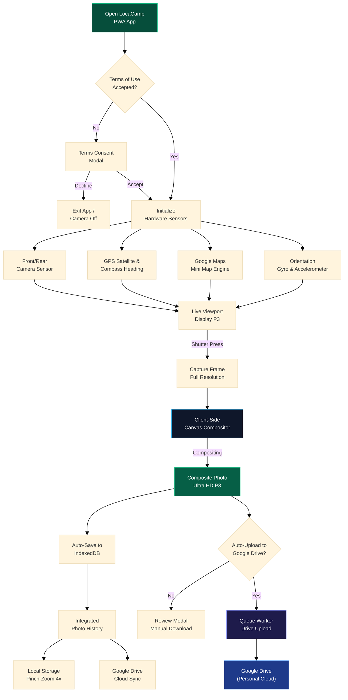

<div align="center">

  

  # 📸 LocaCamp
  ### Next-Generation Smart Geotagging Camera, Canvas Compositor & Google Drive Sync PWA
  
  **Client-Side Field Documentation Platform with Real-Time Satellite GPS Geotagging, Official Watermarking, and Direct Peer-to-Cloud Backup.**

  <p align="center">
    <a href="https://locacamp.pages.dev/" target="_blank"></a>
    <a href="https://github.com/maskodingku/LocaCamp"></a>
    <a href="https://react.dev/"></a>
    <a href="https://www.typescriptlang.org/"></a>
    <a href="https://vitejs.dev/"></a>
    <a href="https://tailwindcss.com/"></a>
    
    
    
    <a href="LICENSE"></a>
  </p>

  <p align="center">
    <a href="https://locacamp.pages.dev/" target="_blank">
      
    </a>
    <a href="https://locacamp.pages.dev/home" target="_blank">
      
    </a>
  </p>

  <p align="center">
    <a href="#-live-demo--official-links">Live Demo</a> •
    <a href="#-about-locacamp">About</a> •
    <a href="#-key-features--technical-capabilities">Key Features</a> •
    <a href="#-architecture--workflow">Architecture</a> •
    <a href="#-tech-stack">Tech Stack</a> •
    <a href="#-directory-structure">Folder Structure</a> •
    <a href="#-installation--getting-started">Installation</a> •
    <a href="#-developer-profile--ownership">Developer Profile</a> •
    <a href="#-google-api-user-data-policy-compliance">Google Compliance</a>
  </p>
</div>

---

## 🌐 Live Demo & Official Links

**LocaCamp** is globally deployed and active across Cloudflare Pages edge CDN network. You can test all camera capabilities, satellite geotagging, visual filters, and Google Drive cloud synchronization directly in your mobile or desktop browser without installing third-party apps:

| Service | Public URL | Description |
| :--- | :--- | :--- |
| 📸 **Primary Camera App (PWA)** | [**https://locacamp.pages.dev/**](https://locacamp.pages.dev/) | Real-time geotagging camera, watermark compositor, and offline history. |
| 🏠 **Official Homepage** | [**https://locacamp.pages.dev/home**](https://locacamp.pages.dev/home) | Developer ownership homepage following Google Cloud guidelines (answer/13807376). |
| 🛡️ **Privacy Policy** | [**https://locacamp.pages.dev/privacy**](https://locacamp.pages.dev/privacy) | Google User Data Policy compliance, Limited Use disclosures, 100% on-device guarantee. |
| 📄 **Terms of Service** | [**https://locacamp.pages.dev/terms**](https://locacamp.pages.dev/terms) | MIT license terms, field survey data integrity guidelines, liability limitations. |
| 💻 **Open Source Repository** | [**https://github.com/maskodingku/LocaCamp**](https://github.com/maskodingku/LocaCamp) | Complete, transparent open source codebase available for public audit. |

---

## 🌟 About LocaCamp

**LocaCamp** is a modern Progressive Web Application (PWA) designed to validate, stamp, and automate field documentation in real time. By uniting web camera hardware APIs, high-precision GPS satellite positioning, reverse street geocoding, physical orientation detection, Display P3 wide color gamut canvas rendering, and direct peer-to-cloud Google Drive synchronization, **LocaCamp** produces industry-standard documentation photos with precise location timestamps and official institution logos without requiring app store installations.

All image compositing and photo history storage take place **100% on the user's device (client-side)** with zero third-party proxy servers, ensuring absolute privacy, zero upload latency, and seamless operation even in remote field locations without cellular signal.

---

## ✨ Key Features & Technical Capabilities

### 1. 🛰️ High-Precision Satellite Geotagging & Satellite Mini Map
- **Live Satellite Coordinates**: Real-time Latitude, Longitude, Altitude (Elevation), and dynamic GPS Accuracy tolerance in meters.
- **Accurate Compass Heading**: Real-time device orientation and compass bearing angle (Azimuth).
- **Embedded Satellite Mini Map**: Embeds a live Google Maps satellite snippet directly onto the photo canvas with automated subdomain failover.
- **Reverse Geocoding**: Automatically translates raw GPS coordinates into street name, neighborhood, district, city, and province.
- **Automated Timezone Detection**: Automatically identifies the local timezone (**WIB**, **WITA**, **WIT**, or GMT) according to geographic longitude.
- **9-Point Quadrant Placement**: Flexible positioning of geotag timestamps across 9 areas of the frame (Top-Left, Top-Center, Top-Right, Center-Left, Center, Center-Right, Bottom-Left, Bottom-Center, Bottom-Right).

### 2. ☁️ Standalone Google Drive Cloud Sync (OAuth 2.0 Client-Side)
- **Instant 1-Click Connection**: Integrated directly with Google OAuth 2.0 without requiring users to configure complex credentials.
- **Minimal Access Scope (`drive.file`)**: The application only requests `https://www.googleapis.com/auth/drive.file`, restricted strictly to files created by LocaCamp.
- **Automated Folder Isolation**: All survey photos are automatically stored in a dedicated user-owned folder named **LocaCamp Photos**, keeping other Drive documents completely untouched.
- **Background Queue Worker**: Built-in background queue processor with adjustable bulk concurrency settings.
- **Auto-Upload on Capture**: Optional toggle to automatically enqueue freshly captured photos for Google Drive upload.
- **Live Status & Visual Badges**:
  - Quick action banner to *"Upload X Pending Photos"* when local un-synced photos are detected.
  - Distinct green Google Drive status badge on photo cards that are successfully synced.
  - Real-time animated progress bar and upload percentage indicators.
- **Dual-Tab Gallery**: Tab 1 *Browser Storage (IndexedDB)* and Tab 2 *Google Drive Cloud* for streamlined inspection.

### 3. 📷 Hardware Camera Engine, Display P3 & High-Res Sensor Tiers
- **Sensor Resolution Selection**: Supports *Auto Max Sensor*, *12 MP*, *24 MP*, *48 MP*, *50 MP*, up to ultra-sharp *108 MP* tiers.
- **JPEG Quality Tiers**: 4 visual compression tiers: Standard (85%), Sharp (95%), Ultra HD (98%), and Lossless P3 (100%).
- **Wide Gamut Color & Display P3 Engine**: Renders composite frames using Display P3 wide color gamut to preserve the optical sensor's rich color spectrum without saturation loss.
- **Intelligent Denoise & Smoothing**: Automated noise reduction algorithm designed to maintain sharpness in low-light environments.
- **Live Visual Presets & Fine-Tuning**:
  - 6 real-time color presets: *Standard*, *Vivid*, *Warm*, *Cold*, *Monochrome*, and *Golden Hour*.
  - Real-time sliders for Brightness, Contrast, and Saturation adjustments.
- **Camera Mirror Mode**: Toggle front/rear camera mirror reflection with synchronized WYSIWYG framing.
- **Torch / Flashlight Control & Multi-Lens**: Instant hardware torch toggle and seamless front/rear camera switching.

### 4. 🎨 Customizable Watermark Logo & Live Transparent Preview
- **Preloaded Official Logos**: Pre-embedded official company logos (**PT Wahana Mitra Amerta**) and LocaCamp concepts.
- **Custom Logo Upload**: Upload project/agency PNG/JPG logos with automatic client-side resizing and compression.
- **Live Transparent Drag Preview**: When adjusting watermark settings sliders, the camera viewport stays live and translucent so users see adjustments in real time.
- **Corner Positioning & Opacity**: Place logos in any of the 4 corners with smooth opacity tuning from 0% to 100%.

### 5. 🗄️ Smart Offline Photo History (IndexedDB Storage)
- **Client-Side Storage**: Captures are stored in the browser's structured `IndexedDB` database, avoiding `localStorage` memory limits and requiring no internet connection.
- **Touch Gestures (Pinch-to-Zoom & Pan)**: Zoom survey inspection photos up to 4x magnification with smooth two-finger panning.
- **Swipe Gestures**: Swipe left or right to seamlessly browse consecutive photos in fullscreen mode.
- **Pure Fullscreen Mode**: Clean distraction-free inspection with tap-to-toggle toolbar functionality.
- **Smart Search & Date Filtering**: Search by location text, coordinates, or date with preset ranges (*Today*, *Last 7 Days*, *This Month*).

### 6. 🔋 Hardware Power-Saving & Smart Multi-Tab Broadcaster
- **Automated Multi-Tab Management (`BroadcastChannel`)**: Opening LocaCamp in a new browser tab automatically turns off the camera in older tabs, preventing hardware stream conflicts and conserving memory.
- **Hardware Power Conservation**: Optical camera sensors automatically shut down completely whenever the user opens the Settings Drawer, Photo History, Preview Review, Terms Dialog, or static homepage.

### 7. 📱 Native Mobile Navigation & Progressive Web App (PWA)
- **Hierarchical Back Button Support**: Integrates `window.history` and `popstate` events (*Fullscreen Inspect → History Gallery → Main Camera View*).
- **Ergonomic Landscape Adaptation**: Rotating the phone horizontally shifts shutter controls to the right thumb edge for natural camera handling.
- **1-Click PWA Installation**: Install directly to the homescreen on Android, iOS, Windows, and MacOS without app store friction.
- **Offline Capable**: Registered Service Worker and cached assets ensure full functionality in remote off-grid locations.

### 8. ⚖️ Legal Transparency & Google Cloud Compliance
- **Official Homepage (`/home`)**: Adheres to Google Cloud [App Homepage guidelines (answer/13807376)](https://support.google.com/cloud/answer/13807376), verifying developer **Abdi Syahputra Harahap** and support email **Anggista Parasela**.
- **Google API Limited Use Disclosure**: Fully compliant with the Google API Services User Data Policy.
- **Terms & Privacy Consent**: Mandatory first-launch consent dialog with local state persistence.
- **Google Site Verification**: Integrated HTML verification file and site-verification meta tag for Google Search Console.

---

## 🏗️ Architecture & Workflow



---

## 💻 Tech Stack

| Category | Technology | Description |
| :--- | :--- | :--- |
| **Frontend Framework** | **React 19** + **TypeScript** | Modular component architecture (*Anti-Monolith*) with strict type safety. |
| **Build Tool & Bundler** | **Vite 8** | High-performance bundler with instant HMR and optimized gzip chunking. |
| **Styling & Design** | **Tailwind CSS v4** | Modern dark-mode interface with refined glassmorphism and mobile ergonomics. |
| **Icon Library** | **Lucide React** | Consistent, crisp SVG icons across the interface. |
| **Graphics & Compositing** | **HTML5 Canvas 2D API (Display P3)** | High-resolution compositing, minimap blending, and lossless rendering. |
| **Client Storage** | **IndexedDB & LocalStorage** | Structured client-side storage for survey captures and user configuration. |
| **Cloud Integration** | **Google Drive REST API v3 (OAuth 2.0)** | Direct peer-to-cloud upload to isolated folders without intermediate servers. |
| **PWA & Offline** | **Web App Manifest + Service Worker** | Standalone app experience installable across mobile and desktop environments. |
| **Local Web Server** | **Node.js ESM (`app.js`)** | Lightweight Express static server with directory traversal protection and SPA fallback. |
| **Edge Cloud Hosting** | **Cloudflare Pages** | Global edge hosting with automated CI/CD deployment linked to GitHub `main`. |

---

## 📁 Directory Structure

```text
LocaCamp/
├── UI/                                 # Frontend application source (React 19 + TypeScript + Vite 8)
│   ├── public/                         # Public static assets (favicon, logo, manifest, service worker, GSC verification)
│   ├── src/
│   │   ├── assets/                     # Graphic assets, official logos, developer profile images
│   │   ├── components/
│   │   │   ├── camera/                 # Camera viewport, shutter button, torch controls
│   │   │   ├── history/                # History modal, Drive queue status, local/cloud tabs, zoom view
│   │   │   ├── home/                   # Modular official homepage components (/home)
│   │   │   ├── legal/                  # Privacy policy (/privacy) and terms of service (/terms) views
│   │   │   ├── overlay/                # Geotag badge, watermark layer, minimap, satellite status
│   │   │   ├── preview/                # Photo review modal, download, and share actions
│   │   │   └── settings/               # Settings drawer (camera, watermark, denoise, Google Drive)
│   │   ├── hooks/
│   │   │   ├── useCamera.ts            # Camera stream control, resolution tiers, mirror, torch
│   │   │   ├── useGeolocation.ts       # GPS satellite, compass heading, reverse geocoding
│   │   │   ├── useGoogleDrive.ts       # Google Drive OAuth 2.0 integration & session state
│   │   │   ├── useGoogleDriveQueue.ts  # Background upload queue worker hook
│   │   │   ├── useModalHistory.ts      # Native mobile back button navigation (popstate)
│   │   │   ├── useOrientation.ts       # Hardware physical orientation sensor (portrait/landscape)
│   │   │   └── usePWAInstall.ts        # PWA installation prompt hook
│   │   ├── services/
│   │   │   └── googleDriveService.ts   # Google Drive multipart upload API service
│   │   ├── types/                      # TypeScript interfaces and data models
│   │   ├── utils/
│   │   │   ├── canvasComposite.ts      # Canvas compositing engine (watermark, geotag, denoise)
│   │   │   ├── miniMapGenerator.ts     # Google Maps satellite thumbnail generator
│   │   │   ├── photoStorage.ts         # Client-side IndexedDB database engine
│   │   │   ├── storage.ts              # Local configuration handler (localStorage)
│   │   │   └── timezone.ts             # Automatic timezone detection algorithm (WIB/WITA/WIT/GMT)
│   │   ├── App.tsx                     # SPA router and root application coordinator
│   │   ├── index.css                   # Tailwind CSS styling and custom utilities
│   │   └── main.tsx                    # React 19 entry point
│   ├── package.json                    # Frontend UI dependencies
│   └── vite.config.ts                  # Vite 8 bundler configuration
├── siap-deploy/                        # Production build output directory (Vite output)
├── app.js                              # Local Node.js ESM server for serving production build
├── package.json                        # Root repository script runner
├── LICENSE                             # MIT License
├── README.md                           # Indonesian documentation
└── README_EN.md                        # English documentation
```

---

## 🚀 Installation & Getting Started

### Prerequisites
- **Node.js**: Version `18.x`, `20.x`, or higher
- **Web Browser**: Modern version of Google Chrome, Microsoft Edge, Safari, or Firefox with Camera and Location permissions enabled (HTTPS / Localhost).

### Step 1: Clone Repository
```bash
git clone https://github.com/maskodingku/LocaCamp.git
cd LocaCamp
```

### Step 2: Install Dependencies
```bash
# Install root dependencies
npm install

# Install frontend UI dependencies
cd UI
npm install
cd ..
```

### Step 3: Run Development Server
For local code development with Hot Module Replacement (HMR):
```bash
cd UI
npm run dev
```
Open your browser at the displayed local URL (typically `http://localhost:5173`).

### Step 4: Build for Production
To bundle and compile the application for production:
```bash
npm run build --prefix UI
```

### Step 5: Start Local Production Server
Run the production Node.js ESM server:
```bash
npm start
```
Access the application in your browser at: **`http://localhost:3000`**.

---

## 🔒 Google API User Data Policy Compliance

**LocaCamp** adheres strictly to the Google API Services User Data Policy:
1. **Minimal Scope Usage**: The application exclusively requests `https://www.googleapis.com/auth/drive.file`. This scope strictly restricts access only to files and folders created directly by LocaCamp.
2. **Direct Peer-to-Cloud Architecture**: Photo uploads are transmitted directly from the user's browser to Google Drive servers over encrypted HTTPS, with zero intermediate proxy or storage servers.
3. **Limited Use Disclosure**:
   > *"LocaCamp's use and transfer to any other app of information received from Google APIs will adhere to the Google API Services User Data Policy, including the Limited Use requirements."*
4. **Revocable Access**: Users can disconnect Google Drive integration at any time from the app Settings or through their Google Account dashboard at `https://myaccount.google.com/permissions`.

---

## 👨‍💻 Developer Profile & Ownership

<div align="center">
  

  ### **Abdi Syahputra Harahap**
  **Lead Fullstack Developer & Creator of LocaCamp PWA**  
  *Specialization: High-Performance Distributed Systems, Canvas 2D Graphic Engines, and Modern Web Architectures.*

  📧 Developer Email: [maskoding12@gmail.com](mailto:maskoding12@gmail.com)  
  🌐 GitHub Repository: [https://github.com/maskodingku/LocaCamp](https://github.com/maskodingku/LocaCamp)

  <br/>

  ### **Anggista Parasela**
  **Project Co-Owner & Official Support Lead**  
  *Google Cloud Platform Project Owner & Verified Property Owner in Google Search Console (GSC).*

  📧 Official Support Email: [anggistaparasela@gmail.com](mailto:anggistaparasela@gmail.com)
</div>

<br/>

> ### 🏛️ Company Dedication Statement
> 
> *"This application was developed and dedicated as a token of heartfelt gratitude and loyalty to the Management and Extended Family of **PT Wahana Mitra Amerta** for the trust and mandate given to me as part of the company.*
> 
> *May this geotagging innovation contribute substantially toward strengthening field survey accuracy, operational oversight efficiency, and the digital excellence of **PT Wahana Mitra Amerta** moving forward."*
> 
> **— Abdi Syahputra Harahap**

---

## 📄 License

This project is licensed under the **[MIT License](LICENSE)**.  
Copyright © 2026 **Abdi Syahputra Harahap**, **Anggista Parasela**, & **PT Wahana Mitra Amerta**.  

*Permission is hereby granted, free of charge, to any person obtaining a copy of this software and associated documentation files, to deal in the Software without restriction, including without limitation the rights to use, copy, modify, merge, publish, distribute, sublicense, and/or sell copies of the Software.*
